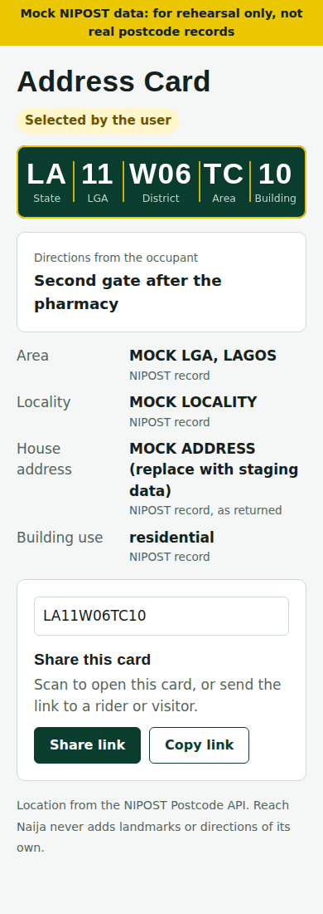
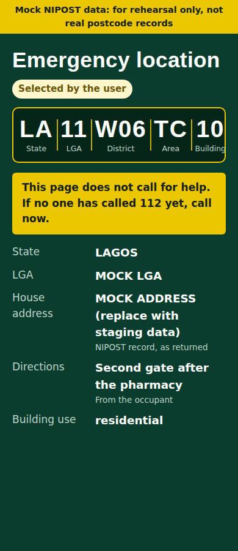
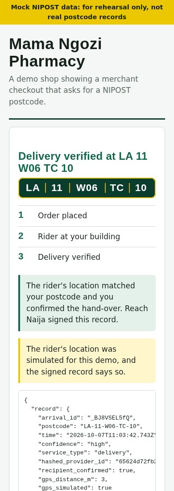
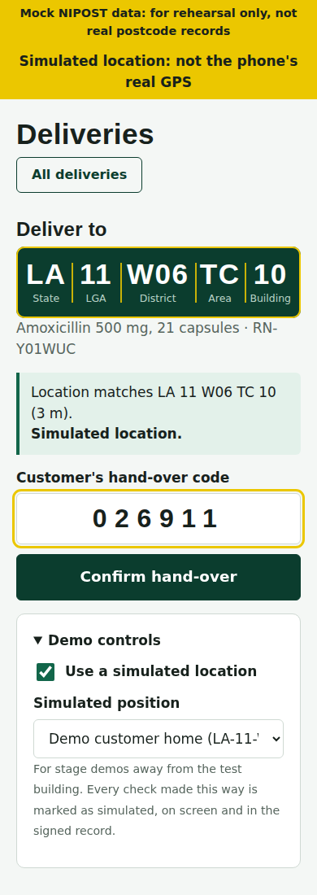
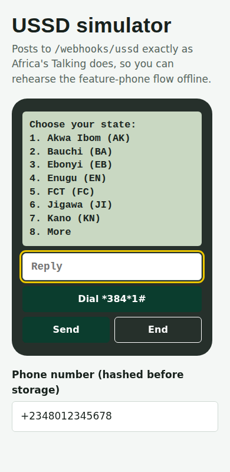
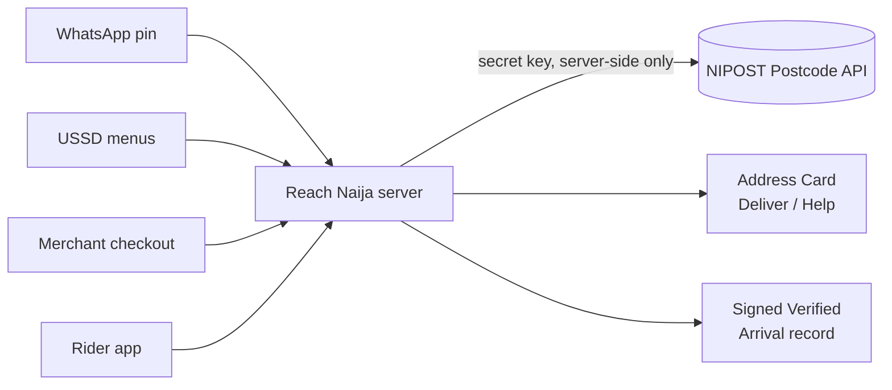

# Reach Naija

**One postcode. Verified. Actionable. Everywhere.**

Reach Naija turns the WhatsApp location pin Nigerians already share into a verified [NIPOST](https://api.postcode.gov.ng) postcode. That postcode becomes an Address Card any business or responder can act on, and Reach Naija records proof when a service actually reaches the door.

It's an entry for the Honourable Minister's call to embed Nigeria's new national postcode in commerce, transport, healthcare, agriculture, emergency response and community life.

  

> **Status: working demo.** It runs out of the box on a built-in mock of the NIPOST API, and switches to NIPOST staging with one setting. Mock data is labelled on every screen and message. This is not production software yet; see [Roadmap](#roadmap).

---

## Why

NIPOST has given every addressable building a five-segment postcode, `LA 11 W06 TC 10`: state, LGA, district, area, building. Finding a postcode is solved. Using one isn't:

- People share pins and landmarks ("the house after the pharmacy, opposite the school"), not codes.
- Most citizens won't install an app to learn a code, and many use feature phones.
- Riders and ambulance crews still lose time on the last 50 metres.
- Nobody can prove a delivery, a vaccination or a subsidy reached the right building.

Reach Naija moves every postcode along one path:

**Address → Verified Address → Actionable Address → Verifiable Service**

## What it does

| Stage | What happens | In this repo |
| --- | --- | --- |
| **Find** | Share a WhatsApp pin and get your postcode plus a voice note reading it out. Feature phones step through USSD menus. No app to install. | `server/src/channels/` |
| **Verify** | Every postcode becomes an **Address Card**: a link, a QR code and a confidence badge from NIPOST's own data. Anything below high confidence asks you to pick your building; there are no silent wrong answers. | `server/src/cards/`, `web/card/` |
| **Act** | One card, three modes: **Deliver** for merchants and riders, **Help** for families and 112 responders, and **Register** for banks and public services (data model only so far). | `web/card/`, `web/shop/` |
| **Prove** | **Verified Arrival**: a delivery is confirmed only when the rider's GPS matches the building *and* the customer gives their hand-over code. The result is an Ed25519-signed record. | `server/src/arrival/`, `web/rider/` |

<p>
  
  
  
  
  
</p>

*Address Card, Help mode, verified checkout, rider check-in and USSD, running on mock data.*

## Quick start

You need **Node.js 22.18 or newer**. Node runs the TypeScript directly, so there is no build step. On Windows, use WSL 2 (Ubuntu).

```bash
git clone <this-repo> reach-naija && cd reach-naija
cp .env.example .env
npm install
npm run dev
```

Open <http://localhost:3000>. In another terminal, check every flow end to end:

```bash
npm run smoke      # → All checks passed.
```

On a fresh WSL machine, `bash scripts/setup-wsl.sh` installs Node, ffmpeg and cloudflared for you. The full guide is [docs/SETUP.md](docs/SETUP.md). It covers NIPOST staging keys, the HTTPS tunnel, WhatsApp Cloud API, Africa's Talking USSD, PostgreSQL, voice clips and troubleshooting.

### Try the demo

| Page | What to do |
| --- | --- |
| `/` | **Create a sample card**, then add `?mode=help` to the card's address to see the dispatcher view |
| `/shop/` | Enter `LA 11 W06 TC 10`, **Check postcode**, **Place order**, and note the hand-over code |
| `/rider/` | Turn on **Demo controls → Use a simulated location**, tap the delivery, **I'm at the building**, enter the code |
| `/shop/` | Watch the order change to *Delivery verified*; **Check signature** |
| `/ussd/` | **Dial**, then `1` → `8` → `1` → `1` → `2` → `1` → `1` |

## How it works



One Node.js server handles the API, both webhooks and the web pages. The pages are plain HTML and JavaScript with no framework and no build step. Storage is in-memory by default, with PostgreSQL optional.

| NIPOST endpoint | Used for |
| --- | --- |
| `GET /v1/search/reverse` | Turning a WhatsApp pin or a rider's GPS into a postcode (25 m default) |
| `GET /v1/search/nearby` | "Pick your building" when the match isn't certain (300 m) |
| `GET /v1/search/autocomplete` | USSD state → LGA → district → area → building menus |
| `GET /v1/lookup?level=1` | Free validity check at checkout |
| `GET /v1/lookup?level=2-3` | Names, recent house address and building use on the card |
| `POST /v1/assembly/assemble` | Turning typed input into a canonical postcode |

## Design principles

These are enforced in code, not just stated:

- **NIPOST is the only source of location.** AI and the app never invent a postcode, an address or a landmark. Every field on a card is labelled with its source. Voice notes are stitched from recorded clips, not generated.
- **Secret keys never leave the server.** Only NIPOST's publishable key reaches the browser, and only for NIPOST's own widget.
- **The card identifies a building, not a person.** Lookups stop at level 3, so the app never requests building-owner data or point geometry.
- **Identifiers are hashed, coordinates aren't kept.** Phone numbers and rider ids are stored only as keyed hashes. Pins are never stored, and reverse-geocode results are never cached.
- **Proof needs two signals.** GPS alone can be spoofed and a QR plate can be photographed, so Verified Arrival also needs the recipient's code. A simulated location is written into the signed record as `gps_simulated: true`.
- **Help links don't pretend to call for help.** Every Help card tells the user to call 112 first, and the link expires after 12 hours.

## Project layout

```
server/src/
  nipost/              NIPOST client, cache, and a mock used when NIPOST_MODE=mock
  cards/               Pin → postcode, Address Cards, expiring Help cards
  channels/whatsapp/   Cloud API webhook; replies in English and Pidgin
  channels/ussd/       Africa's Talking callback; autocomplete-driven menus
  arrival/             Verified Arrival: GPS check, one-time code, Ed25519 signing
  checkout/            Free L1 check and orders
  store/               In-memory or PostgreSQL, same interface
  voice/               Voice notes stitched from recorded clips with ffmpeg
web/                   Card, shop, rider and USSD simulator pages
fixtures/              NIPOST test postcodes and demo coordinates
scripts/               Setup, tunnel, migrations, signing keys, smoke test
docs/                  Setup guide and screenshots
```

## Configuration

All settings live in `.env`; see [.env.example](.env.example).

| Setting | Default | What it does |
| --- | --- | --- |
| `NIPOST_MODE` | `mock` | `mock` uses fixtures; `live` calls the NIPOST API |
| `NIPOST_SECRET_KEY` | | Your `nipost_test_…` staging key (live mode) |
| `NIPOST_MAX_LEVEL` | `3` | Lookup level you were granted; features fall back to level 1 |
| `PUBLIC_URL` | `http://localhost:3000` | Your HTTPS tunnel address, used in card links |
| `STORE` | `memory` | `memory` or `postgres` |
| `WA_TOKEN`, `WA_PHONE_ID` | | WhatsApp Cloud API; without them, replies go to a dry-run outbox |
| `HASH_SECRET` | | Key for hashing phone numbers; change it before real users |

## Roadmap

- [x] Working demo on mock NIPOST data
- [ ] Run on NIPOST staging, with real coordinates for the test postcodes
- [ ] Live WhatsApp test number and Africa's Talking USSD sandbox
- [ ] Hausa, Yoruba and Igbo voice clips and replies
- [ ] Production hardening:
  - [ ] sovereign hosting in Lagos and Abuja
  - [ ] signing keys moved into hardware security modules
  - [ ] DPIA and NDPA compliance
  - [ ] logins for riders and dispatchers
  - [ ] hand-over codes sent to the recipient by WhatsApp or SMS
- [ ] Six-month pilot: Lagos (LA 11), FCT (FC 02), Kano (KN 31), Jigawa (JI 24)
- [ ] National Pulse dashboard and an open Address Card specification

Production hosting is designed to Nigeria's NITDA National Cloud Computing Guideline 2026 and the Nigeria Data Protection Act 2023. Personal, health, emergency and financial data stay in Nigeria.

## Known gaps

- The coordinates in `fixtures/demo-locations.json` are placeholders. Replace them with points that resolve to the test postcodes on NIPOST staging.
- The Pidgin replies need review by a native speaker.
- Some NIPOST behaviours aren't fully specified in the public reference, and the code handles each defensively. The [setup guide](docs/SETUP.md#check-these-on-staging) lists them:
  - the shape of the `/search/nearby` response
  - autocomplete paging
  - whether Search needs an API key
- Sending the card link by SMS at the end of the USSD flow is not built yet.

## Contributing

Issues and pull requests are welcome, especially from people working in logistics, health, emergency response, fintech or agriculture who want to shape the pilot.

Before opening a pull request, run `npm run smoke` and `npm run typecheck`.

## License

No license has been chosen yet. Add one before making this repository public.

---

*Reach Naija is an independent proposal and is not affiliated with or endorsed by NIPOST or the Federal Ministry.*
